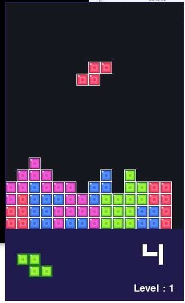

# Tetris

[](https://forthebadge.com)
[](https://forthebadge.com)
[](https://forthebadge.com)

Tetris is a simple 2D Tetris game made with python and pygame.

<p align='center'>
	
</p>

## How to Download

Download this project from here [Download Tetris](https://downgit.github.io/#/home?url=https://github.com/pyGuru123/Python-Games/tree/master/Tetris)

## Requirements

Use the package manager [pip](https://pip.pypa.io/en/stable/) to install following packages :-
* Pygame

```bash
pip install pygame
```

## Usage

Double click the main.py to open the game, The game will start automatically.

Controls:
* Use Left arrow key to move left and Right arrow key to move right.
* Use Down arrow key to fall faster.
* Use Up arrow key to rotate the figures.
* Use Space to fall at once.
* Press P to pause or unpause the game.
* Press Esc to quit the game.

## Contributing

Pull requests are welcome. For major changes, please open an issue first to discuss what you would like to change.

Please make sure to update tests as appropriate.